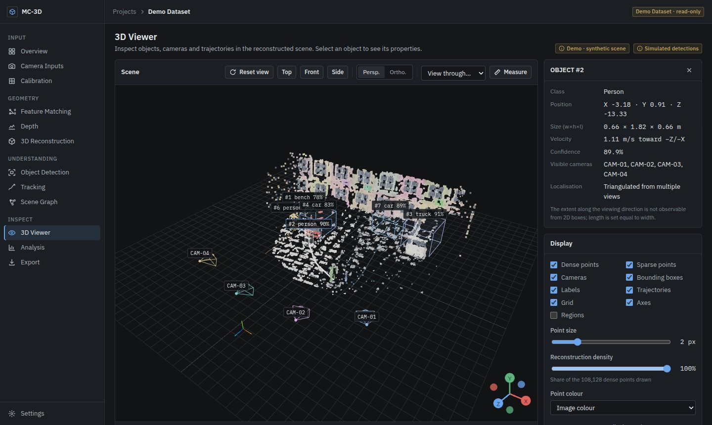
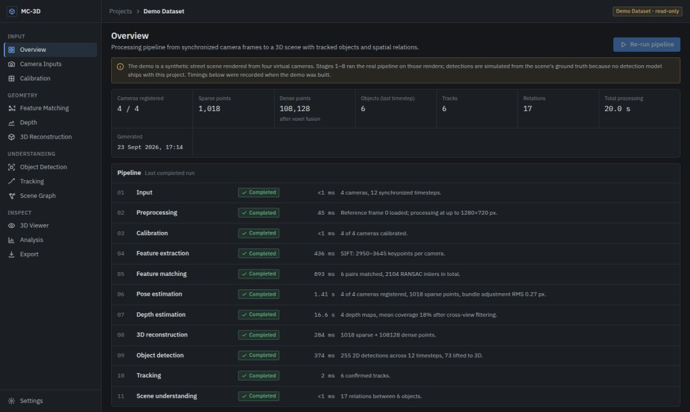
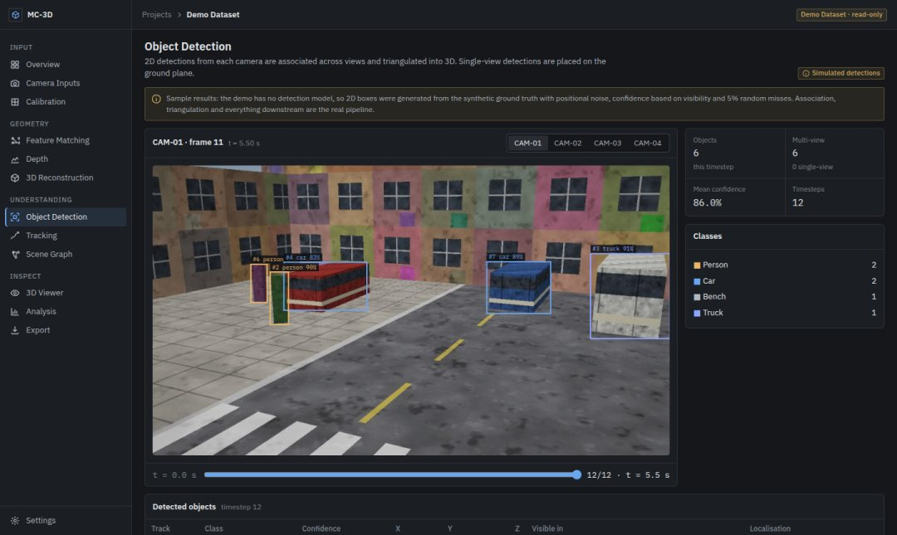

# Multi-Camera 3D Scene Understanding

Reconstruct and inspect a 3D scene from synchronized multi-camera observations.

Two to eight cameras observe the same area. The system calibrates and registers them in a
shared world frame, estimates dense depth for every view, fuses a coloured point cloud,
places detected objects in 3D, tracks them over time and derives spatial relations
("person near car", "car on road"). A web workspace shows every intermediate result, from
feature matches to the final scene graph.



<p>
  
  
</p>

## Why

A single camera sees a scene from one side and cannot measure depth or keep track of an
object that walks behind another. Several cameras together can, but only once they share a
coordinate frame and their observations are associated. This project implements that chain
end to end (calibration, registration, dense geometry, 3D detection, tracking and a
geometric scene graph) with the parts kept small enough to read and test.

## Features

* **Camera inputs**: image sequences or video per camera, with per-file validation, frame preview and synchronisation checks.
* **Calibration**: checkerboard (Zhang's method), manual intrinsics, or an explicitly flagged assumption.
* **Feature matching**: SIFT / ORB / AKAZE, Lowe ratio + mutual check, MAGSAC++ fundamental matrix; an interactive match viewer for any camera pair.
* **Structure from motion**: multi-view feature tracks, essential-matrix initialisation, PnP registration and a Schur-complement bundle adjuster written in NumPy.
* **Dense depth**: plane-sweep multi-view stereo with ZNCC, sub-plane refinement and cross-view consistency filtering; 16-bit depth maps with per-pixel confidence.
* **3D reconstruction**: voxel-fused point cloud, RANSAC ground plane, metric scale from a measured camera baseline.
* **Object detection** (optional model): YOLOv8 ONNX through OpenCV DNN; detections are triangulated across views or placed on the ground plane.
* **Tracking**: alpha–beta filter with class-gated association; trajectories, speed and heading per track.
* **Scene graph**: `near`, `on`, `inside`, `behind` relations, each with the measurement that produced it.
* **3D viewer**: WebGL point cloud with LOD, camera frustums, boxes, trajectories, look-through-camera, orthographic views and a measurement tool.
* **Analysis and export**: stage timings, reprojection error, bundle-adjustment convergence; PLY, JSON and CSV exports.

### Honest by construction

Every scene carries a `provenance` block, and the UI labels anything that is not computed
from the user's data. Real projects never get simulated results: without a detection model,
detection, tracking and the scene graph are reported as *skipped*. The bundled demo is
marked as synthetic throughout.

## Demo dataset

`frontend/public/demo` holds a synthetic street scene so the whole workspace can be explored
without a backend. It is produced by `backend/scripts/build_demo.py`, which

1. ray-casts a textured street (ground, facades, vehicles, pedestrians) from four virtual cameras over 12 timesteps,
2. runs the **real pipeline** on the rendered JPEGs (the renderer's camera poses are not used),
3. adds simulated 2D detections derived from the ground truth (no detection model is bundled) and runs the real association, tracking and scene-graph code on them,
4. evaluates the result against the ground truth.

Against that ground truth the demo reconstruction reaches camera position errors of a few
millimetres, rotation errors below 0.1° and a median depth error of about 0.3 % (98 % of depth
pixels within 5 %). The Analysis page lists the per-camera figures. These numbers describe a
clean synthetic scene with exact intrinsics; real footage will do worse.

## Tech stack

| Layer | Choice |
| --- | --- |
| Frontend | React 19, TypeScript, Vite, CSS modules, React Router |
| 3D and charts | three.js with React Three Fiber / drei, Recharts |
| Backend | Python 3.11, FastAPI, Pydantic, SQLAlchemy 2 |
| Vision | OpenCV 4, NumPy (no PyTorch needed at runtime) |
| Database | SQLite in development, PostgreSQL in production |
| Tests | pytest, Vitest + Testing Library |

## Running locally

Requirements: Python 3.11+, Node 20+.

```bash
# backend (http://localhost:8000, API docs at /api/v1/docs)
cd backend
python -m venv .venv && source .venv/bin/activate
pip install -r requirements-dev.txt
cp .env.example .env
uvicorn app.main:app --reload

# frontend (http://localhost:5173), in another terminal
cd frontend
npm install
cp .env.example .env.local        # sets VITE_API_URL=http://localhost:8000/api/v1
npm run dev
```

Without `VITE_API_URL` the frontend runs in demo-only mode.

To try your own data, create a project, add at least two cameras that overlap, upload a few
frames per camera (the same moment in time should have the same index in every camera) and
start the reconstruction from the Overview page. Calibrating the cameras and entering the
distance between CAM-01 and CAM-02 in Settings gives metric results.

Rebuilding the demo (about 4 minutes):

```bash
cd backend && python -m scripts.build_demo
```

## Environment variables

Backend (`backend/.env.example` lists all of them):

| Variable | Default | Purpose |
| --- | --- | --- |
| `DATABASE_URL` | `sqlite:///./data/mc3d.db` | SQLite or PostgreSQL URL |
| `STORAGE_DIR` | `./data/storage` | Uploaded frames and results |
| `CORS_ORIGINS` | `http://localhost:5173,…` | Allowed frontend origins |
| `MAX_IMAGE_MB` / `MAX_VIDEO_MB` | 25 / 250 | Upload limits |
| `MAX_CAMERAS` / `MAX_FRAMES_PER_CAMERA` | 8 / 300 | Project limits |
| `PROCESSING_TIMEOUT_S` | 600 | Per-run time limit |
| `DETECTOR_MODEL_PATH` | empty | YOLOv8 ONNX model, see [docs/models.md](docs/models.md) |

Frontend: `VITE_API_URL`, the backend base URL including `/api/v1`. No secrets are used in the frontend.

## API

REST + JSON under `/api/v1`, with structured errors (`code`, `message`, `hint`). The full
endpoint list is in [docs/api.md](docs/api.md); Swagger UI is served at `/api/v1/docs`.

```
POST /projects                      GET  /scene/{id}
POST /projects/{id}/cameras         GET  /scene/{id}/objects
POST /cameras/{id}/frames           GET  /scene/{id}/files/points.bin
POST /cameras/{id}/video            POST /projects/{id}/feature-matching
POST /cameras/{id}/calibration      POST /projects/{id}/runs   (reconstruction / detection / tracking)
GET  /projects/{id}/runs/latest     GET  /projects/{id}/export?format=ply
```

## Project structure

```
backend/
  app/
    api/routes/       HTTP endpoints
    core/             settings, error types
    database/         SQLAlchemy models and session
    services/         projects, media ingestion, storage, run manager
    pipeline/         stage orchestration and scene document writer
    vision/           camera model, features, calibration
    reconstruction/   SfM, bundle adjustment, plane-sweep MVS, fusion, alignment
    detection/        ONNX detector, multi-view lifting
    tracking/         3D tracker
    scene/            spatial relations
    synthetic/        procedural scene + renderer used for the demo and tests
  scripts/build_demo.py
  tests/
frontend/
  src/
    pages/            landing, projects, one folder per workspace page
    three/            viewport, point cloud, frustums, labels
    components/       UI primitives, error boundary
    context/ hooks/ services/ utils/ types/ workers/
  public/demo/        generated demo dataset
docs/                 architecture, API, scene format, models, deployment
```

More detail: [docs/architecture.md](docs/architecture.md) and [docs/scene-format.md](docs/scene-format.md).

## Testing

```bash
cd backend && python -m pytest -q          # 43 tests, ~15 s
cd frontend && npm test                    # 48 tests
cd frontend && npm run lint && npm run typecheck && npm run build
```

Backend tests cover the API (validation, uploads of valid/corrupt/empty/oversized/mismatched
files, videos, calibration), the vision modules on synthetic renders (matching, checkerboard
calibration, SfM recovering known cameras), the tracker, the relation rules, the binary
formats and a full pipeline run through the API. Frontend tests cover validation, API error
handling (network failure, timeout, gateway errors), the binary codecs, exports and the main
UI components. GitHub Actions runs everything on each push.

## Deployment

Frontend on Vercel or Netlify, backend as a Docker service on Render or Railway with
PostgreSQL; see [docs/deployment.md](docs/deployment.md). `render.yaml`,
`frontend/vercel.json` and `frontend/netlify.toml` are included.

## Known limitations

* No detection model is bundled; detection needs `DETECTOR_MODEL_PATH`.
* Cameras are assumed static. Poses are estimated once, from the reference frame, and the point cloud shows the scene at that frame.
* Frames are synchronised by index, not by timestamp.
* Without calibration the intrinsics are guessed, which bends the geometry and can prevent ground-plane detection.
* Dense stereo is CPU-only and dominates run time; very wide baselines (> 50° between neighbouring cameras) get no dense depth.
* 3D box length along the viewing direction is not observable from 2D boxes and is set equal to the width.
* Uploaded data lives on the server's disk; there is no user authentication, so do not expose an instance publicly without putting authentication in front of it.

## Future improvements

* Timestamp-based synchronisation and rolling-shutter-aware matching.
* Per-timestep reconstruction for moving cameras.
* Learned depth (e.g. a monocular prior) to fill textureless regions.
* Kalman filter with Hungarian assignment for crowded scenes.
* Database migrations (Alembic) and authentication.
* Streaming large point clouds in tiles.

## Licence

MIT, see [LICENSE](LICENSE).
